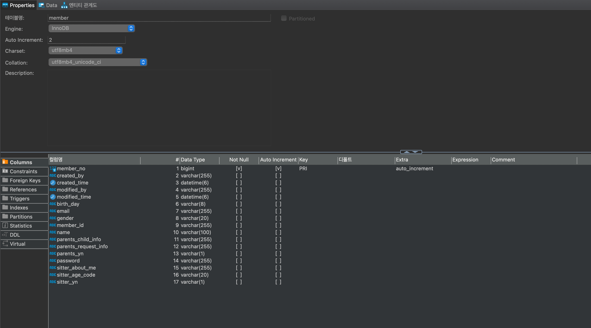

## 사용언어

- 언어 : Kotlin 1.7
- Build : gradle
- spring boot : 3.0.6
- JPA, QueryDSL, Swagger, jjwt, Spring Security, MySQL(Docker)

## 테이블 구조

## 기능

http://localhost:18081/swagger-ui/index.html

- 공통코드 조회
- 회원가입
- 내정보보기
- 회원정보수정
- 로그인

